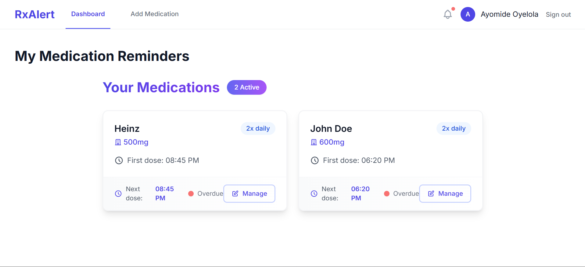
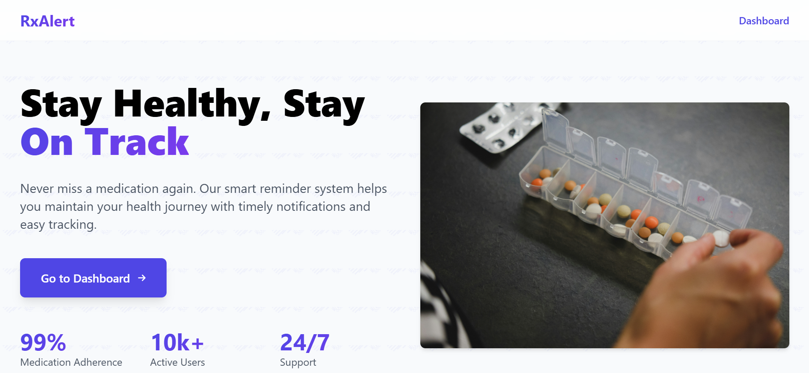

# RxAlert

**RxAlert** is a medication reminder system designed to help users track their medications, receive timely notifications, and log their doses. The system is currently in development.

---

## Features

- Add, edit, and delete medications
- Schedule reminders for multiple doses per day
- Receive notifications for upcoming doses
- Track medication history

---

## Screenshots

---

## Status

Currently in production — active development is ongoing.

---

## Author

Ayomide Oyelola
